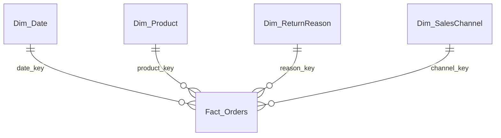

# 📊 Why Customer Return Products | Power BI Dashboard

An end-to-end Power BI project that transforms raw e-commerce order data into a two-page, interactive dashboard uncovering **why customers return products** and **where refund losses are coming from**.

> Built with Power Query for data cleaning, a Star Schema data model, and custom DAX measures for KPI tracking, trend analysis, and root-cause diagnostics.

---

## 🖼️ Dashboard Preview

### Page 1 — Executive Summary
Overview of orders, returns, refund amount, monthly trends, sales-channel contribution, and top return reasons.


### Page 2 — Product Diagnostics
Subcategory vs. return-reason heatmap, discount-risk scatter plot, and product-level performance table.


---

## 🎯 Project Overview

Returns and refunds quietly eat into e-commerce margins. This dashboard was built to help a business quickly answer:

- What is our overall **return rate** and **refund amount**?
- Which **categories, subcategories, and products** drive the most returns?
- What are customers' **top reasons** for returning items?
- Does **higher discounting** correlate with a **higher return rate**?
- How are returns trending **month over month**, and across **sales channels**?

The dataset used is **synthetic**, created for educational/portfolio purposes.

---

## 🧰 Tools & Tech Stack

| Tool | Purpose |
|---|---|
| **Power BI Desktop** | Dashboard design & visualization |
| **SQL** | Data cleaning & transformation |
| **DAX** | Calculated measures & columns |
| **Star Schema** | Data modeling (Fact & Dimension tables) |

---

## 🧹 Data Preparation (Power Query)

- Cleaned and standardized raw transactional data
- Handled inconsistent category/subcategory naming
- Built a proper **Fact table** (Orders/Returns) linked to **Dimension tables** (Product, Date, Return Reason, Sales Channel)
- Structured the model as a **Star Schema** for optimal DAX performance

---

## 📐 Data Model
   


## 📊 Key DAX Measures

A sample of the core measures powering the dashboard:

```dax
Total Orders = COUNTROWS(Fact_Orders)

Returned Orders = 
CALCULATE([Total Orders], Fact_Orders[Is_Returned] = TRUE())

Return Rate % = 
DIVIDE([Returned Orders], [Total Orders], 0)

Refund Amount = 
SUM(Fact_Orders[Refund_Amount])

Avg Return Days = 
AVERAGE(Fact_Orders[Return_Processing_Days])

Cumulative Return % (Pareto) = 
VAR CurrentReason = MAX(Dim_ReturnReason[Return_Reason])
VAR RunningTotal = 
    CALCULATE(
        [Returned Units],
        FILTER(
            ALL(Dim_ReturnReason),
            Dim_ReturnReason[Rank] <= MAX(Dim_ReturnReason[Rank])
        )
    )
RETURN
    DIVIDE(RunningTotal, CALCULATE([Returned Units], ALL(Dim_ReturnReason)))
```

*(Replace with your actual DAX code from the .pbix file before publishing.)*

---

## 📈 Features & Visuals

✅ Data cleaning & standardization in Power Query
✅ Star Schema data modeling (Fact & Dimension tables)
✅ Total Orders, Returned Orders, and Return Rate % KPIs
✅ Refund Amount calculation & Month-over-Month indicators
✅ Monthly Refund/Return Trend chart
✅ Return Reason Pareto (80/20) analysis
✅ Returned Units by Category & Sales Channel
✅ Subcategory vs. Return Reason heatmap
✅ Discount % vs. Return Rate scatter analysis
✅ Dynamic Top Category & Top Return Reason KPI cards
✅ Interactive slicers (date range, sales channel) & page navigation

---

## 🔍 Key Insights

- **Fashion** is the top return category, with **"Product Not As Expected"** as the leading return reason.
- Overall return rate sits around **23%**, with an average return processing time of **~15 days**.
- A cluster of products with **higher average discounts** shows a **noticeably higher return rate**, suggesting discount-driven purchases may lead to more impulse returns.
- **Wrong Size**, **Product Not As Expected**, and **Damaged Product** together account for the majority of returns (Pareto 80/20 pattern).
- Returns are fairly distributed across all four sales channels (Marketplace, Mobile App, Offline Store, Website).

---

## 📁 Project Structure

├── README.md
├── images/
│ ├── executive-summary.png
│ └── product-diagnostics.png
├── data/
│ └── ecommerce_returns_raw.csv # raw/source dataset
├── Returns_Refund_Analysis.pbix # Power BI project file
└── docs/
└── data_dictionary.md # (optional) field definitions


---

## 🚀 How to Use

1. Clone this repository
```bash
   git clone https://github.com/<your-username>/ecommerce-returns-refund-analysis.git
```
2. Open `Returns_Refund_Analysis.pbix` in **Power BI Desktop**
3. Refresh the data source if prompted (point it to `/data`)
4. Explore the two report pages using the slicers and navigation buttons

---

## 📌 Dataset

The dataset is **synthetic** and was created purely for learning and portfolio purposes — it does not represent any real company's data.

---


